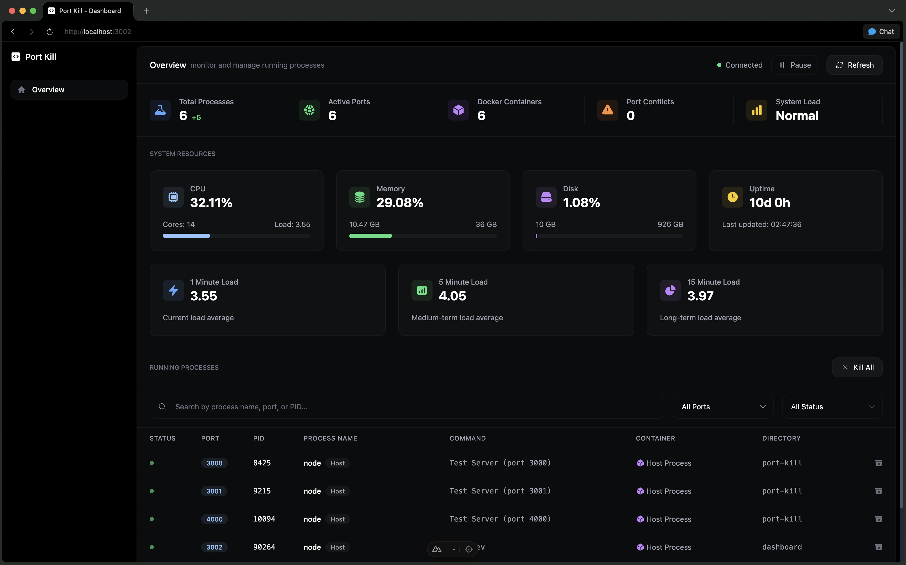

# Port Kill

Port Kill helps you find and free ports blocking your dev work. It works on macOS, Linux, and Windows, locally or over SSH with a simple CLI, status bar and an optional dashboard.


## Community & Support

Join our Discord community for discussions, support, and updates:

[](https://discord.gg/KqdBcqRk5E)


## Install

```bash
# macOS/Linux (when releases are available)
curl -fsSL https://raw.githubusercontent.com/kagehq/port-kill/main/install-release.sh | bash

# Windows (PowerShell)
Invoke-WebRequest -Uri 'https://raw.githubusercontent.com/kagehq/port-kill/main/install-release.bat' -OutFile 'install-release.bat'; .\install-release.bat

# From source
git clone https://github.com/kagehq/port-kill.git && cd port-kill && ./install.sh --all
```

## Quick start (CLI)

```bash
# See what’s using common dev ports
./target/release/port-kill-console --console --ports 3000,8000,8080

# Free up the usual suspects
./target/release/port-kill-console --reset

# Remote over SSH
./target/release/port-kill-console --remote user@host --ports 3000,8000

# Guard mode (watch + auto-resolve)
./target/release/port-kill-console --guard-mode --auto-resolve

# Security audit (JSON)
./target/release/port-kill-console --audit --json
```

## Dashboard (optional)



```bash
cd dashboard
npm install
npm run dev   # http://localhost:3000
```

## MCP (use Port Kill from Cursor)

```bash
cd mcp
npm install
npm run dev    # starts the MCP server
```

Cursor auto-discovers `.cursor/mcp.json`. Then you can run tools like:

```text
port-kill.list { ports: "3000,8000", verbose: true }
port-kill.reset {}
port-kill.kill { ports: "3000" }
port-kill.audit { suspiciousOnly: true }
```

Notes:
- The server shells out to `./target/release/port-kill-console`. If yours lives elsewhere, set `PORT_KILL_BIN=/absolute/path/to/port-kill-console`.
- It runs in the repo root by default. Override with `PORT_KILL_CWD=/your/project` if needed.

See [DETAILED.md](DETAILED.md) for more.

## Features

- Real‑time process detection on specific ports or ranges
- One‑shot cleanup: `--reset`
- Smart filtering and ignore lists
- Port Guard Mode (watch/reserve/auto‑resolve)
- Security Audit Mode (suspicious ports, risk score, JSON)
- Remote Mode over SSH
- Works with Docker; console mode works everywhere

## Common flags

```bash
--ports 3000,8000,8080          # specific ports
--start-port 3000 --end-port 9000
--ignore-ports 5353,5000,7000
--ignore-processes Chrome,rapportd
--guard-mode --auto-resolve
--audit --json
--remote user@server
```


### Manual Installation

1. Clone the repository:
```bash
git clone <repository-url>
cd port-kill
```

2. Install and build (recommended):
```bash
./install.sh
```

Or manually:
```bash
./build-macos.sh
./run.sh
```

### Linux Installation

1. Clone the repository:
```bash
git clone <repository-url>
cd port-kill
```

2. Install required packages:
```bash
# Ubuntu/Debian
sudo apt-get install libatk1.0-dev libgdk-pixbuf2.0-dev libgtk-3-dev libappindicator3-dev

# Fedora/RHEL
sudo dnf install atk-devel gdk-pixbuf2-devel gtk3-devel libappindicator-gtk3-devel

# Arch Linux
sudo pacman -S atk gdk-pixbuf2 gtk3 libappindicator-gtk3
```

3. Install and build (recommended):
```bash
./install.sh
```

Or manually:
```bash
./build-linux.sh
./run-linux.sh
```

### Windows Installation

1. Clone the repository:
```bash
git clone <repository-url>
cd port-kill
```

2. Install Rust (if not already installed):
```bash
# Download and run rustup-init.exe from https://rustup.rs/
```

3. Install and build (recommended):
```bash
./install.sh
```

Or manually:
```bash
build-windows.bat
run-windows.bat
```

## Usage

### Basic Usage

**Platform-Specific Run Scripts:**
- **macOS**: Use `./run.sh` 
- **Linux**: Use `./run-linux.sh`
- **Windows**: Use `run-windows.bat`

1. **Start the Application**: Run the appropriate script for your platform with default settings (ports 2000-6000)
2. **Monitor Status**: Check the status bar for the process count indicator
3. **Access Menu**: Click on the status bar icon to open the context menu
4. **Kill Processes**: 
   - Click "Kill All Processes" to terminate all development processes
   - Click individual process entries to kill specific processes
5. **Quit**: Click "Quit" to exit the application

### Configurable Port Monitoring

The application now supports configurable port ranges and specific port monitoring:

#### Port Range Examples
```bash
# Monitor ports 3000-8080
./run.sh --start-port 3000 --end-port 8080          # macOS
./run-linux.sh --start-port 3000 --end-port 8080    # Linux
run-windows.bat --start-port 3000 --end-port 8080   # Windows

# Monitor ports 8000-9000
./run.sh -s 8000 -e 9000                            # macOS
./run-linux.sh -s 8000 -e 9000                      # Linux
run-windows.bat -s 8000 -e 9000                     # Windows
```

#### Specific Ports Examples
```bash
# Monitor only specific ports (common dev ports)
./run.sh --ports 3000,8000,8080,5000                # macOS
./run-linux.sh --ports 3000,8000,8080,5000          # Linux
run-windows.bat --ports 3000,8000,8080,5000         # Windows

# Monitor React, Node.js, and Python dev servers
./run.sh -p 3000,3001,8000,8080                     # macOS
./run-linux.sh -p 3000,3001,8000,8080               # Linux
run-windows.bat -p 3000,3001,8000,8080              # Windows
```

#### Console Mode
```bash
# Run in console mode for debugging
./run.sh --console --ports 3000,8000,8080

# Console mode with verbose logging
./run.sh -c -p 3000,8000,8080 -v

# Console mode with PIDs shown
./run.sh --console --show-pid --ports 3000,8000,8080

# Console mode for full-screen mode users (recommended)
./run.sh --console --log-level warn --ports 3000,8000,8080

#### Log Level Control
```bash
# Show all logs (default)
./run.sh --log-level info --ports 3000,8000

# Show only warnings and errors
./run.sh --log-level warn --ports 3000,8000

# Show only errors
./run.sh --log-level error --ports 3000,8000

# Show no logs (quiet mode)
./run.sh --log-level none --ports 3000,8000

# Verbose mode (overrides log-level)
./run.sh --verbose --ports 3000,8000
```

## More Detailed Information

This README is intentionally short. For full docs (all features, flags, API, architecture), see [DETAILED.md](DETAILED.md). Windows users: see [WINDOWS.md](WINDOWS.md).

## License

This project is licensed under the FSL-1.1-MIT License. See the LICENSE file for details.

## Contributing

1. Fork the repository
2. Create a feature branch
3. Make your changes
4. Add tests if applicable
5. Submit a pull request
